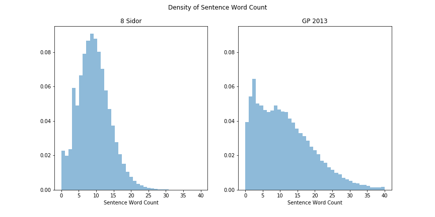
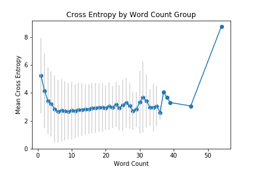

# Cloze-Deletion-Prediction

Cloze deletion prediction project for LT2316 H18 at Göteborg University

Overleaf LaTeX project is available [here](https://www.overleaf.com/read/tmnqdngqrbws)

## Data
On the mltgpu server, all the data is found on `/scratch/gussteen/final_project/`

The original data files are 
  - `/scratch/gussteen/final_project/attasidor.xml.bz2`
  - `/scratch/gussteen/final_project/gp2013.xml.bz2`
  
The processed files are:
  - `/scratch/gussteen/final_project/attasidor.csv`
  - `/scratch/gussteen/final_project/gp2013_sample.csv`
  
The models are found in:
  - `/scratch/gussteen/final_project/models`

## Overview

Note: All of the output models can be found by replacing `./models/` with `/scratch/gussteen/final_project/` so you don't need to re-run the training and processing.

### 1. Create CSVs from XML Data
```
python xml_csv_process.py
```
Reads xml files `{attasidor,gp2013}.xml.bz2` from `/scratch/gussteen/final_project/` and save to same folder.

### 2. Comparing LSTM and Bidirectional LSTM
```
python atta_train.py
```
Trains the model on the created file `/scratch/gussteen/final_project/attasidor.csv`.

Output models: 
  - ./models/atta_lstm.hdf5 
  - ./models/atta_blstm.hdf5

### 3. Run Dropout Experiements
```
python blstm_tuning.py
```
Again loads the file from `/scratch/gussteen/final_project/attasidor.csv`.
Runs the bidirectional model with dropout 0.4, 0.6, 0.8.

Output models: 
  - ./models/atta_blstm_dropout4.hdf5
  - ./models/atta_blstm_dropout6.hdf5
  - ./models/atta_blstm_dropout8.hdf5

### 4. Compare 8 Sidor and GP2013
```
python compare_8sidor_gp2013.py
```
Compares the results from using 8 Sidor dataset and GP2013.
Load 8 Sidor from `/scratch/gussteen/final_project/attasidor.csv` and GP2013 from `/scratch/gussteen/final_project/gp2013_sample.csv`.

Output models:
  - ./models/atta_blstm_8sidor_comp.hdf5
  - ./models/atta_blstm_gp2013_comp.hdf5

### 5. Visualizations

#### Dataset Stats
in `Dataset Stats` notebook you will find the table for the NN, JJ, VB word count along with the density plots for the datasets.



| pos | GP2013 | 8Sidor |
|-----|--------|--------|
| JJ  | 35377  | 4661   |
| VB  | 42729  | 9215   |
| NN  | 291292 | 39844  |

#### Compare LSTM Models
in `Compare LSTM Models` notebook you will find the model visualizations for the LSTM and bidirectional LSTM model.
The plots of the loss and accuracy plots are here as well.


### Compare 8 Sidor and GP2013
in `8Sidor GP2013 Results Compare`, the results for the 8 Sidor dataet and the GP2013 dataset are compared.
The loss and accuracy plot are found here, as well as the dropout comparison plots for the various dropout parameters.


#### Explore Predictions
In `Explore Predictions` notebook you will find the visualization of the predictions cross entropy.



## References

  1. 8 Sidor. 8 sidor. http://8sidor.se, 2018. [Online; accessed 28-October-2018].
  2. Franc ̧ois Chollet et al. Keras. https://keras.io, 2015.
  3. Yarin Gal and Zoubin Ghahramani. A theoretically grounded application of dropout in recurrent neural networks. In Proceedings of the 30th International Conference on Neural Information Processing Systems, NIPS’16, pages 1027–1035, USA, 2016. Curran Associates Inc.
9
  4. Göteborgs universitet. Språkbanken. https://spraakbanken.gu.se, 2018. [Online; accessed 28-October-2018].
  5. Incfk8. RNN BRNN. https://commons.wikimedia.org/wiki/File:RNN_BRNN.png, 2015. File: RNN BRNN.png.
  6. Andrew Ng. Sequence models – Coursera. https://www.coursera.org/learn/ nlp-sequence-models, 2018. Accessed 2018-10-17.
  7 Nitish Srivastava, Geoffrey Hinton, Alex Krizhevsky, Ilya Sutskever, and Ruslan Salakhutdinov. Dropout: A simple way to prevent neural networks from overfitting. Journal of Machine Learning Research, 15:1929–1958, 2014.
  8. Wilson L. Taylor. “cloze procedure”: A new tool for measuring readability. Journalism Bulletin, 30(4):415–433, 1953.
  9. Wikipedia contributors. Cloze test — Wikipedia, the free encyclopedia. https://en.wikipedia. org/w/index.php?title=Cloze_test&oldid=847324700, 2018. [Online; accessed 28-October- 2018].
  10. Wikipedia contributors. Cross entropy — Wikipedia, the free encyclopedia, 2018. [Online; ac- cessed 1-November-2018].
  11. Wikipedia contributors. Göteborgs-posten — Wikipedia, the free encyclopedia. https://en. wikipedia.org/w/index.php?title=G%C3%B6teborgs-Posten&oldid=865127708, 2018. [On- line; accessed 31-October-2018].
  12. Gabriel Wyner. Fluent forever: how to learn any language fast and never forget it. Harmony Books, 2014.